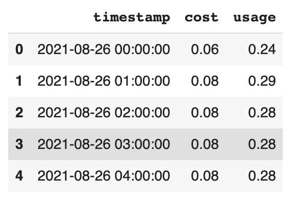
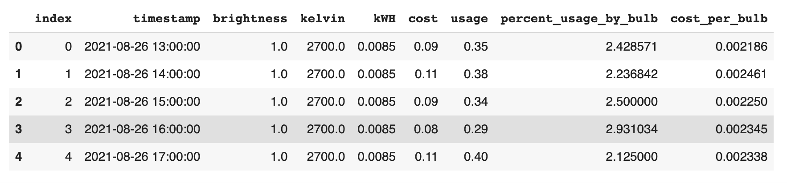
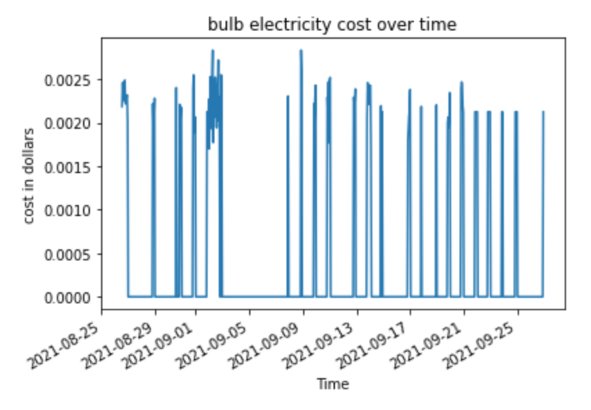

# LIFXBulbAnalysis

Analyze LIFX Bulb and PG&E smart meter useage to forecasts future energy cost, reducing household energy usage and providing a better
smart home experience.

Two light bulbs were purchased from Amazon and installed in the living room of a participant's home. The participants in the home continued using
the light bulbs over a period of six months.

A python client was set up to take continuous readings from the bulbs and write data to a time-series Influx database. The readings in this database
were explored and analyzed via machine learning techinques to forecast future energy costs for the user.

Energy consumption from the bulbs was compared to overall energy usage by the home taken from a PG&E smart meter and energy usage from the thermostat,
taken from a NEST device. Users were shown a history of their energy usage over time to gain further insights into how the household used energy.

### LIFX Bulb API
https://api.developer.lifx.com/docs/list-lights - available fields generated by each light bulb

### Amazon link to purchase bulbs
https://www.amazon.com/dp/B0865TRD5L?ref=ppx_pop_mob_ap_share

### Influx DB resources
Python client: https://docs.influxdata.com/influxdb/cloud/api-guide/client-libraries/python/

Sign up: https://cloud2.influxdata.com/signup

### Influx DB schema

buckets
  - PGE_CSV_Data
    - _measurement = pge_reading
    - _fields = cost, type, units, usage
    - _account_number = 863594456
  - SmartBulbData
    - _measurement = bulb_reading
    - _fields = brightness, connected, hue, kelvin, saturation, power
    - _id = d073d55df12f
    - _label = Light1, Light2

### To Run Notebooks

Notebooks should be run in this order:

1. SmartBulbDataExtractFromInflux.ipynb - extract and save raw LIFX data from Influx to intermediate CSV
2. SmartBulbDataExploration.ipynb - preprocess LIFX data (fill in missing values and time gaps, calculate kwH usage, etc..) and save processed data to CSV
3. PGEDataExtractFromInflux.ipynb - extract PGE cost and usage data from Influx, save to intermediate CSV
4. JoinPGEAndBulbData.ipynb - join LIFX and PGE data on timestamp to created a merged dataframe with total energy and LIFX cost
5. PGE_ARIMA_Model.ipynb, LSTMEnergyModel.ipynb, or SmartBulbARIMAModel.ipynb - models can now be run on merged cost dataframes

Notebooks can be opened in Colab (link included in notebook).
They save and load intermediate data from Google Drive so users will need to authenticate with their own Google Drive account at the top of each notebook.
Influx extraction notebooks also rely on an authentication token tied to a specific Influx bucket, so a database will need to be set up to run these notebooks.

Final intermediate data is saved in the /data folder of this repository.

### Preprocessing

Data queried from SmartBulbData bucket includes

1. timestamp
2. brightness in percent of total lumens available
3. temperature in kelvin
4. power which is either ON or OFF

at a minute-granularity for each minute the bulb was on.

Missing Data

Measurements that contained a brightness but no temperature reading assumed the temperature to follow brightness. So if the bulb was using 100%
of its total lumens the corresponding temperature was filled in as 2.7K (the max temperature capacity for the bulb) and vice versa. If a temperature
was recorded with no brightness the lumens were inferred according to the bulb's heat.

Data was only uploaded when the bulb was on so missing timestamps were filled in and values were set to the default off - 0 lumens used and 0K
temperature reading.

We looked at the time intervals and found average time on was around 3-4 hours in the evening, which corresponded to what participant's told us
about their daily light routines.

Sample of brightness and temperature readings over time:

The maximum wattage for the bulb based on the Amazon purchase was 8.5 Watts. Killowatt hour usage was estimated by calculating time intervals the bulb
was on and multiplying by the light's wattage - 8.5W.

Because participants used lights on an hourly schedule brightness, temperature, and watts were aggregated over each hour, taking the average brightness
and temperature and summing the total watts per hour. Watts were converted into kWh to better compare to PG&E pricing data from the household.

Sample of aggregated, hourly, light dataframe:

Data queried from PG&E Smart Meter data included

1. cost
2. usage
3. timestampe
4. account number

at 15-minute intervals. Smart meter data was aggregated hourly, where the total cost and usage per hour were calculated.

Sample of the aggregated, hourly, PG&E data:

Aggregated, hourly bulb data was joined with aggregated, hourly PG&E Smart Meter data on timestamp to determine what percentage of the househould's
energy bill per hour was due to lighting. This was done by calculating the percentage KW hour usage of the light bulbs from the total, then taking
that percent from the total hourly cost. For example if the total hourly cost was 10$ and the lights used 3 KW / 10 KW or 30% of the energy that hour,
the estimated cost from lighting would be 3$ or 30% of the entire 10$ charge.

The final lighting cost per hour was used in forecasting models to predict how much lighting would cost the household.

Sample of the merged smart meter and bulb data:

After merging the datasets we found that the household's monthly electriciy bill was around 55$, with a total of 212 kWH of useage. The lights 
accounted for <1% of the monthly energy usage at only 0.50$ per month. Based on interviews with the household, low cost and usage for the bulbs
makes sense. There were only two bulbs installed in the living room and the bulbs themselves are very energy-efficient using only 8.5 Watts.
Household participants mentioned the bulk of their appliance usage came from fans and the apartment had new, energy-efficient appliances.

Bulb cost over time:

